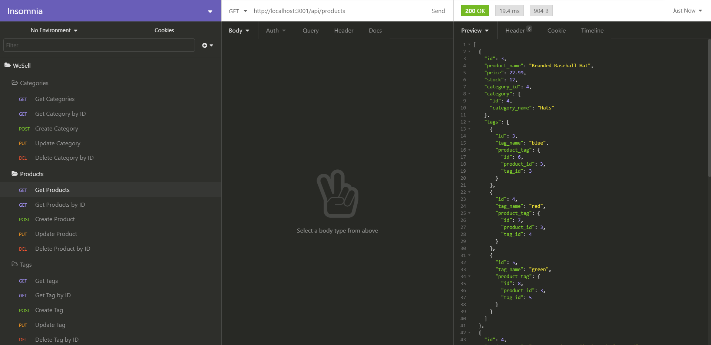

# WeSell

## Description

A backend e-commerce API built with Express.js and Sequelize ORM

## Table of Contents
  * [Installation](#installation)
  * [Usage](#usage)
  * [License](#license)
  * [Contributing](#contributing)
  * [Testing](#testing)
  * [Questions](#questions)
  
## Installation
Clone project to a directory on your local machine using <git clone> and cd into the WeSell directory.  Run <$ npm install> to install dependencies. 

## Usage
Create a <.env> file in the project's root and add environmental variables in the form 

    DB_NAME='<your_database_name>' 
    DB_USER='<your_user_name>' 
    DB_PW='<your_mysql_password>' 

Open a MySQL shell by entering <$ mysql -u root -p> and then enter your password when requested.  
Run the command <mysql source db/schema.sql> to create the database.  
Run the command <mysql show databases;> to verify the <ecommerce_db> database has been added.  
Run the command (mysql quit;> to return to the command line. 
Run the command <$ npm run seed> to seed the database with sample data.  
Run the command <$ npm run watch> to start the server.  
You can now make api requests from the browser or an application like Insomnia or Postman, as demonstrated [here](https://drive.google.com/file/d/1K25O-BXwXq6sCKWEmUfNXshf-rVnPv_2/view).

## License 
This project is covered under the MIT license 

## Contributing
To see the guidelines adopted for contributing to this project, please view the [Contributor Covenant](https://www.contributor-covenant.org/version/2/0/code_of_conduct/code_of_conduct.txt)

## Testing
Tests coming soon

## Questions
Visit me at GitHub  
[christopherConcannon](https://github.com/christopherConcannon)
  
If you have any questions or would like to contact me, please email me at  
[cmcon@yahoo.com](mailto:cmcon@yahoo.com)
